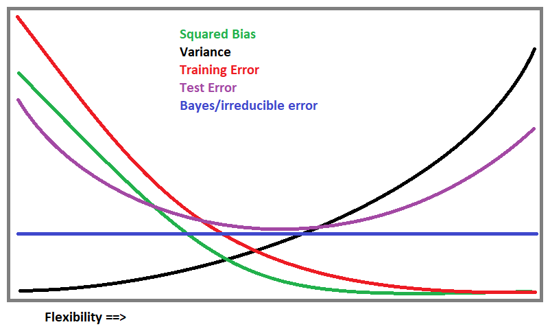

```{r setup, include=FALSE}
knitr::opts_chunk$set(echo = TRUE)
```

# Week 1 Exercises

## Chapter 2 - Exercise 1

### a)
A flexible model would work better than an inflexible model if we have a large sample size and a small number of predictors. This is in part because a large sample size offers a greater picture of the signal in spite of the presence of noise; this reduces the chance that a flexible model will over fit. In addition, a flexible model will be able to handle the small number of predictors in an interpretable way without sacrificing accuracy. An inflexible model, on the other hand, can be inaccurate even if it was based on a very large sample size; it might only be capable of yielding a certain type of model (e.g., a linear model) that simply does not accurately describe the actual data (e.g., a curvilinear relationship).

### b)
When a flexible model is created with many predictors and a small sample size, it performs poorly in comparison with an inflexible model because it will certainly over fit the data. A small sample size is prone to amplifying noise--especially when there are many predictors in play. A flexible model will chase after the noise, not realizing that it is missing the actual signal. In this situation, an inflexible model will perform better; it is grounded by its parameters and will not chase after the whims of the variation of each of the many predictors. Therefore, insofar as the inflexible model is set in motion by a competent analyst, we expect an inflexible model to be much more useful than an over-fitted inflexible model.

### c)
When the relationship between predictors is highly nonlinear, we would expect a flexible model to perform better than an inflexible model. Flexible models are not bound to seeking after a linear relationship--or any specifically shaped relationship, for that matter. Inflexible models, however, seek to describe a relationship with a specific shape already in mind. Unless a statistician happens to choose the exactly correctly shaped inflexible model to describe the data, it will almost certainly be inferior to a flexible model, which will attempt seek the best possible model no matter how the data are shaped.

### d)
When the variance of the error terms is extremely high, a flexible model has trouble seeing the signal in the data through the errors; it will therefore attempt to over fit the data and generally produce a poorer result than an inflexible model. An inflexible model is more apt to handle highly variable errors because it seeks to generalize the variation in the data, not becoming distracted by erratic variation and mistaking it for the true signal in the relationship.

## Chapter 2 - Exercise 3

### a)
```{r 3a_picture, echo = FALSE}

```

### b)
Here are the explanations for the curves above:

 - i) Squared bias decreases as flexibility increases because bias is the error introduced by approximating the data with a model. Fitting increasingly flexible models to a data set causes more and more over-fitting; so as a model becomes more and more flexible, it will approximate less and less, attempting to fit the data exactly. As flexibility trends towards infinity, there will be virtually no difference between the model’s predictions and the actual data (which is what bias is). 
 - ii) Variance will only increase with flexibility because the more flexible a model is, the more it will change with new data points. A more flexible model attempts to fit the data more closely, so an extremely flexible model will “bend over backwards” for a single new data point, reforming itself to fit it well.
 - iii) Training error will only decrease with flexibility because if a model is being created using a specific data set, the more flexible one makes that model, the more closely the model will try to correctly classify all the data points. The extremely flexible model will simply (and probably unhelpfully) ensure that all data in the training data set will be correctly classified.
 - iv) Test error decreases with flexibility at first because as flexibility increases, a model will pick up the trends and nuances of how the data should be classified; testing an appropriately flexible model with test data will produce the best possible results in which the fewest possible test data points will be misclassified. However, there is a tipping point: as flexibility increases too much, the model over-fits on the training data and ends up codifying the noise in the training data. Therefore, a model’s test error will start to rise again when it becomes more and more overly flexible because it is no longer trying to approximate the actual relationship, but simply trying to correctly classify the training data alone.
 - v) Bayes error curves/irreducible error curves are constant by definition; irreducible error is the error that will remain no matter how good a model is. So no matter how flexible a model is, there will always be random variation that cannot be explained away. 


## Chapter 2 - Exercise 8

### a)
```{r prompt_8a}
college = read.csv("College.csv")
```

### b)
```{r prompt_8b}
fix(college)

rownames(college) = college[,1]
fix(college)

college = college[,-1]
fix(college)
```


### c)

#### i)
```{r prompt_8c_i}
summary(college)
```

#### ii)
```{r prompt_8c_ii}
pairs(college[,1:10])
```

#### iii)
```{r prompt_8c_iii}
plot(college$Private,college$Outstate)
```

#### iv)
```{r prompt_8c_iv}
Elite = rep("No", nrow(college))
Elite[college$Top10perc > 50] = "Yes"
Elite = as.factor(Elite)
college = data.frame(college , Elite)

summary(college)

plot(college$Elite, college$Outstate)
```

There are 78 "Elite" colleges and 699 that are not "Elite."

#### v)
```{r prompt_8c_v}
attach(college)
par(mfrow=c(2,2))
hist(Apps, breaks=5)
hist(Apps, breaks=15)
hist(Apps, breaks=25)
hist(Apps, breaks=35)

par(mfrow=c(2,2))
hist(Accept, breaks=5)
hist(Accept, breaks=15)
hist(Accept, breaks=25)
hist(Accept, breaks=35)

par(mfrow=c(2,2))
hist(Enroll, breaks=5)
hist(Enroll, breaks=15)
hist(Enroll, breaks=25)
hist(Enroll, breaks=35)
```

#### vi)
```{r prompt_8c_vi}
plot(college$Private,college$Books)

plot(college$Elite,college$PhD)

plot(college$Elite,college$perc.alumni)
```

Private colleges have a rather variable distribution in estimated book costs; the median is a bit lower than non-private colleges' book costs. 

The distribution of the percentage of faculty with Ph.Ds at non-elite is much wider than that of elite colleges, and it is centered lower overall (though its maximum is higher). 

Unsurprisingly, there are overall higher graduation donation percentages for elite colleges than for non-elite colleges; the spread is about the same, though.


# Week 2 Exercises

## Chapter 3 - Exercise 9

For parts a) and b) I refrained from converting `origin` into a factor since the prompts seem to want me to keep it numeric. Sorry if this was misguided.

### a)
```{r prompt_9a}
Auto=read.table("Auto.data",header=T,na.strings ="?")

pairs(Auto[,-9])
```

### b)
```{r prompt_9b}
cor(Auto[,-9], use="pairwise.complete.obs")
```

### c)
For part c) I could stand it no longer; I turned `origin` into a factor variable.

```{r prompt_9c}
Auto$origin = as.factor(Auto$origin)

model1 = lm(mpg ~ cylinders + displacement + horsepower + weight + acceleration + year + origin, Auto)
summary(model1)
```

 - i) With an F-statistic of 224.5, which produces a p-value < 0.0001, we conclude at an alpha level of 0.05 that there is a relationship between the predictors and the cars' `mpg`.
 - ii) Based on the p-values associated with each variable, at an alpha level of 0.05, all predictors except for `cylinders` and `acceleration` had a statistically significant relationship to `mpg` as last predictors in.
 - iii) The coefficient associated with `year`, which is 0.777, indicates that for each increase of one year, a car is predicted to have an increase of 0.777 in `mpg`.
 
### d)
```{r prompt_9d}
plot(model1)
```

 - Based on the Residuals vs Fitted plot, there appears to be a modestly curvilinear relationship between the fitted values and residuals, indicating nonlinear data. This means that the linear regression method used may not be appropriate. Furthermore, this plot reveals possible heteroscedasticity, as the variance in the residuals seems to increase as fitted values get larger. 
 - Based on the Normal Q-Q plot, there is no major concern with normality in these data. There is really only one observation at the high end of the graph, observation 323, that is fairly notably high and a possibly problematic outlier. It should be examined, but normality can be appropriately assumed. 
 - The Scale-Location plot somewhat corroborates the heteroscedasticity assessment, but it does not look egregious. A transformation still couldn't hurt.
 - Based on the Residuals vs Leverage plot, there are no individual data points with concerningly high leverage. 

### e)
```{r prompt_9e}
model2 = lm(mpg ~ cylinders * displacement * horsepower * weight * acceleration * year * origin, Auto)
anova(model1, model2)
```
 
Based on the extremely low p-value produced by the `anova()` function, there are indeed statistically significant interactions between the predictor variables.

### f)
```{r prompt_9f_1}
Auto$displacement.t = log(Auto$displacement)
Auto$horsepower.t = log(Auto$horsepower)
Auto$weight.t = log(Auto$weight)

model.t = lm(mpg ~ cylinders * displacement.t * horsepower.t * weight.t * acceleration * year * origin, Auto)
plot(model.t)
```

Taking a log transformation of `displacement` helps to make a linear relationship more appropriate, but it does not solve the problem of heteroscedasticity and furthermore it creates some high-leverage points.

```{r prompt_9f_2}
Auto$year.t = (Auto$year)^2

model.t2 = lm(mpg ~ cylinders * displacement.t * horsepower.t * weight.t * acceleration * year.t * origin, Auto)
plot(model.t2)
```

Squaring `year` did not seem to change anything.

```{r prompt_9f_3}
Auto$mpg.t = log(Auto$mpg)

model.t3 = lm(mpg.t ~ cylinders * displacement.t * horsepower.t * weight.t * acceleration * year.t * origin, Auto)
plot(model.t3)
```

Taking the log of `mpg` seemed to solve all our problems except for a couple of high-leverage points. Let's see if removing the transformations of the predictors helps...

```{r prompt_9f_4}
model.t4 = lm(mpg.t ~ cylinders * displacement * horsepower * weight * acceleration * year * origin, Auto)
plot(model.t4)
```

We seem to get the same results with those variables untransformed. Our last attempt will be to take the square root of `mpg` instead of the log.

```{r prompt_9f_5}
Auto$mpg.t2 = log(Auto$mpg)

model.t5 = lm(mpg.t2 ~ cylinders * displacement * horsepower * weight * acceleration * year * origin, Auto)
plot(model.t5)
```

We're still left with one or two high-leverage points. We'll say we're satisfied with `model.t4`, in which only `mpg` has been log-transformed.


# Chapter 3 - Exercise 15

```{r load_MASS}
library(MASS)
```

### a)
```{r prompt_15a}
model.zn = lm(crim ~ zn, Boston)
model.indus = lm(crim ~ indus, Boston)
model.chas = lm(crim ~ chas, Boston)
model.nox = lm(crim ~ nox, Boston)
model.rm = lm(crim ~ rm, Boston)
model.age = lm(crim ~ age, Boston)
model.dis = lm(crim ~ dis, Boston)
model.rad = lm(crim ~ rad, Boston)
model.tax = lm(crim ~ tax, Boston)
model.ptratio = lm(crim ~ ptratio, Boston)
model.black = lm(crim ~ black, Boston)
model.lstat = lm(crim ~ lstat, Boston)
model.medv = lm(crim ~ medv, Boston)

summary(model.zn)
summary(model.indus)
summary(model.chas)
summary(model.nox)
summary(model.rm)
summary(model.age)
summary(model.dis)
summary(model.rad)
summary(model.tax)
summary(model.ptratio)
summary(model.black)
summary(model.lstat)
summary(model.medv)
```

All variables are statistically significant predictors of `crim`, the per capita crime rate by town, except for `chas`, the Charles River dummy variable.

```{r prompt_15a_graphs}
plot(Boston$zn, Boston$crim)
plot(Boston$indus, Boston$crim)
plot(Boston$chas, Boston$crim)
plot(Boston$nox, Boston$crim)
plot(Boston$rm, Boston$crim)
plot(Boston$age, Boston$crim)
plot(Boston$dis, Boston$crim)
plot(Boston$rad, Boston$crim)
plot(Boston$tax, Boston$crim)
plot(Boston$ptratio, Boston$crim)
plot(Boston$black, Boston$crim)
plot(Boston$lstat, Boston$crim)
plot(Boston$medv, Boston$crim)
```

We can see from scatterplots of `crim` plotted on each predictor variable that it makes sense that the computer sees a trend for each variable, except `chas` (which is really a binary variable). This does not necessarily mean that there is a linear relationship between `crim` and these variables, but there certainly is some kind of relationship in each case.

### b)
```{r prompt_15b}

model.b = lm(crim ~ zn + indus + chas + nox + rm + age + dis + rad + tax + ptratio + black + lstat + medv, Boston)
summary(model.b)
```

Most of these predictors aren't significant. 

However, at an alpha level of 0.05, we can reject the null hypothesis for the predictors `zn`, `dis`, `rad`, `black`, and `medv`, since their last-in p-values are all below 0.05.

### c)
```{r prompt_15c}
simple.coefficients = c(coefficients(model.zn)[2], coefficients(model.indus)[2],
                        coefficients(model.chas)[2], coefficients(model.nox)[2],
                        coefficients(model.rm)[2], coefficients(model.age)[2],
                        coefficients(model.dis)[2], coefficients(model.rad)[2],
                        coefficients(model.tax)[2], coefficients(model.ptratio)[2],
                        coefficients(model.black)[2], coefficients(model.lstat)[2],
                        coefficients(model.medv)[2])
multiple.coefficients = coefficients(model.b)[2:14]
plot(simple.coefficients, multiple.coefficients)
```

The corresponding simple regression coefficient and multiple regression coefficient for each variable are generally in the same area except for one. Looking at the data will reveal which variable:

```{r prompt_15c_2}
simple.coefficients
```

The `nox` variable is the one with a much different coefficient for both simple- and multiple-linear regression.

### d)
```{r prompt_15d}
model.zn.nonlinear = lm(crim ~ poly(zn, 3), Boston)
model.indus.nonlinear = lm(crim ~ poly(indus, 3), Boston)
model.chas.nonlinear = lm(crim ~ chas + I(chas^2) + I(chas^3), Boston)
model.nox.nonlinear = lm(crim ~ poly(nox, 3), Boston)
model.rm.nonlinear = lm(crim ~ poly(rm, 3), Boston)
model.age.nonlinear = lm(crim ~ poly(age, 3), Boston)
model.dis.nonlinear = lm(crim ~ poly(dis, 3), Boston)
model.rad.nonlinear = lm(crim ~ poly(rad, 3), Boston)
model.tax.nonlinear = lm(crim ~ poly(tax, 3), Boston)
model.ptratio.nonlinear = lm(crim ~ poly(ptratio, 3), Boston)
model.black.nonlinear = lm(crim ~ poly(black, 3), Boston)
model.lstat.nonlinear = lm(crim ~ poly(lstat, 3), Boston)
model.medv.nonlinear = lm(crim ~ poly(medv, 3), Boston)

anova(model.zn, model.zn.nonlinear)
anova(model.indus, model.indus.nonlinear)
anova(model.chas, model.chas.nonlinear)
anova(model.nox, model.nox.nonlinear)
anova(model.rm, model.rm.nonlinear)
anova(model.age, model.age.nonlinear)
anova(model.dis, model.dis.nonlinear)
anova(model.rad, model.rad.nonlinear)
anova(model.tax, model.tax.nonlinear)
anova(model.ptratio, model.ptratio.nonlinear)
anova(model.black, model.black.nonlinear)
anova(model.lstat, model.lstat.nonlinear)
anova(model.medv, model.medv.nonlinear)
```

At the alpha level of 0.05, the polynomial transformation of all predictor variables produce statistically significantly better models except for `chas` and `black`. (`chas` is a binary variable anyway, so the transformation did not change the model at all). This means that there is evidence of a non-linear relationship between each of these predictor variables and `crim`. 


## Titanic Experimentation

```{r setup_get_data_T}
library(titanic)
titanic = na.omit(titanic_train)
titanic$Pclass = as.factor(titanic$Pclass)
titanic$Sex = as.factor(titanic$Sex)
titanic$Embarked = as.factor(titanic$Embarked)
```

```{r create_train_test_T}
train = 1:(dim(titanic)[1]*.8)
test = (dim(titanic)[1]*.8 + .1):dim(titanic)[1]

titanic.train = titanic[train,]
titanic.test = titanic[test,]
```

```{r logistic_regression1_T}
log.reg1 = glm((Survived == 1) ~ Pclass + Sex + Age + SibSp + Parch + Fare + Embarked, data=titanic.train, family=binomial)
summary(log.reg1)

log.reg.probabilities1 = predict(log.reg1, titanic.test, type="response")
log.reg.predictions1 = ifelse(log.reg.probabilities1 >= 0.5, 1, 0)
mean(log.reg.predictions1 != titanic.test$Survived)
```

It is clear that `Parch`, `Fare`, and `Embark` offer no useful information as last predictors in, so we will ignore these variables hereafter. 

We had a test error of 17.5%, which isn't very good.

We'll now rerun logistic regression only with `Pclass`, `Sex`, `Age`, and `SibSp` along with the interaction between `Sex` and `Age`.

```{r log_reg2_T}
log.reg2 = glm((Survived == 1) ~ Pclass + Sex * Age + SibSp, data=titanic.train, family=binomial)
summary(log.reg2)

log.reg.probabilities2 = predict(log.reg2, titanic.test, type="response")
log.reg.predictions2 = ifelse(log.reg.probabilities2 >= 0.5, 1, 0)
mean(log.reg.predictions2 != titanic.test$Survived)
```

This improves our test error a little bit; it is down to 16.8%.

```{r LDA1_T}
lda1 = lda((Survived == 1) ~ Pclass + Sex * Age + SibSp, data=titanic.train)

lda.predictions.text1 = predict(lda1, titanic.test)
lda.predictions1 = ifelse(lda.predictions.text1$class == "TRUE", 1, 0)

mean(lda.predictions1 != titanic.test$Survived)
```

This linear discriminant analysis has 18.2% test error, which is worse than logistic regression.

We'll now try the k-nearest-neighbors procedure with k=3.

```{r KNN_T}
library(class)
train.X = cbind(titanic.train$Pclass, titanic.train$Sex, titanic.train$Age, titanic.train$SibSp)
test.X  = cbind(titanic.test$Pclass, titanic.test$Sex, titanic.test$Age, titanic.test$SibSp)

set.seed(1)
knn1 = knn(train.X, test.X, titanic.train$Survived, k = 1)
mean(knn1 != titanic.test$Survived)
```

This procedure has also yielded 18.2% test error. We'll try a series of KNN procedures with different values for k: 3, 10, 50, and 100.

```{r KNN_2_T}
set.seed(3)
knn3 = knn(train.X, test.X, titanic.train$Survived, k = 3)
mean(knn3 != titanic.test$Survived)

set.seed(5)
knn5 = knn(train.X, test.X, titanic.train$Survived, k = 5)
mean(knn5 != titanic.test$Survived)

set.seed(10)
knn10 = knn(train.X, test.X, titanic.train$Survived, k = 10)
mean(knn10 != titanic.test$Survived)

set.seed(50)
knn50 = knn(train.X, test.X, titanic.train$Survived, k = 50)
mean(knn50 != titanic.test$Survived)

set.seed(100)
knn100 = knn(train.X, test.X, titanic.train$Survived, k = 100)
mean(knn100 != titanic.test$Survived)
```

We get worse test error as we increase k. 

Our best model so far was the pared-down logistic regression model that included the interaction term between Sex and Age.

We will try a little more fiddling with interaction terms to see if we can get an even better result.

```{r final_logistic_regression_T}
log.reg3 = glm((Survived == 1) ~ Pclass * Sex * Age + SibSp, data=titanic.train, family=binomial)
summary(log.reg3)

log.reg.probabilities3 = predict(log.reg3, titanic.test, type="response")
log.reg.predictions3 = ifelse(log.reg.probabilities3 >= 0.5, 1, 0)
mean(log.reg.predictions3 != titanic.test$Survived)
```

Including all interaction terms has yielded a 15.4% test error rate.

```{r test_set_T}
titanic_test = titanic_test
titanic_test$Pclass = as.factor(titanic_test$Pclass)
titanic_test$Sex = as.factor(titanic_test$Sex)

log.reg.probabilities4 = predict(log.reg3, titanic_test, type="response")
log.reg.predictions4 = ifelse(log.reg.probabilities4 >= 0.5, 1, 0)
final_predictions = data.frame(PassengerId = 1:418, Survived = log.reg.predictions4, row.names = 1)
write.csv(final_predictions, "titanic_test_sample_predictions.csv")
```
 

# Week 3 Homework
## Chapter 4 - Exercise 13

```{r create_median_binary_variable}
median(Boston$crim)
Boston$crim.above.median = ifelse(Boston$crim >= median(Boston$crim), 1, 0)
```

```{r create_train_test}
train = 1:(dim(Boston)[1]*.8)
test = (dim(Boston)[1]*.8 + .1):dim(Boston)[1]

Boston.train = Boston[train,]
Boston.test = Boston[test,]
```


```{r logistic_regression1}
log.reg = glm((crim.above.median == 1) ~ zn + indus + chas + nox + rm + age + dis + rad + tax + ptratio + black + lstat + medv, data=Boston.train, family=binomial)
summary(log.reg)

log.reg.probabilities = predict(log.reg, Boston.test, type="response")
log.reg.predictions = ifelse(log.reg.probabilities >= 0.5, 1, 0)
mean(log.reg.predictions != Boston.test$crim.above.median)
```

Using a kitchen sink model on the training data set, at an alpha level of 0.05, there seem to be statistically significant predictors of whether a suburb will have a crime rate above the median; namely, they are `nox`, `dis`, `rad`, `ptratio`, and `medv`. The AIC for this model is 239.93.

The error rate on this test sample was 9.8%. 

Now we will create another model using only the statistically significant predictors.

```{r logistic_regression2}
log.reg2 = glm((crim.above.median == 1) ~ nox + dis + rad + ptratio + medv, data=Boston.train, family=binomial)
summary(log.reg2)

log.reg.probabilities2 = predict(log.reg2, Boston.test, type="response")
log.reg.predictions2 = ifelse(log.reg.probabilities2 >= 0.5, 1, 0)
mean(log.reg.predictions2 != Boston.test$crim.above.median)
```

The AIC for this model is actually a little higher at 212.32, so by this metric this is a worse model; this is corroborated by the higher test error rate of 13.7%

Therefore, the kitchen-sink logistic regression model was preferable.

```{r LDA1}
lda1 = lda((crim.above.median == 1) ~ zn + indus + chas + nox + rm + age + dis + rad + tax + ptratio + black + lstat + medv, data=Boston.train)

lda.predictions.text1 = predict(lda1, Boston.test)
lda.predictions1 = ifelse(lda.predictions.text1$class == "TRUE", 1, 0)

mean(lda.predictions1 != Boston.test$crim.above.median)
```

This linear discriminant analysis has 12.7% test error. 

Now we'll only use the variables found to be statistically significant in the logistic regression.

```{r LDA2}
lda2 = lda((crim.above.median == 1) ~ nox + dis + rad + ptratio + medv, data=Boston.train)

lda.predictions.text2 = predict(lda2, Boston.test)
lda.predictions2 = ifelse(lda.predictions.text2$class == "TRUE", 1, 0)

mean(lda.predictions2 != Boston.test$crim.above.median)
```

This produces 13.7% test error. So, LDA suffered less than logistic regression suffered after removing the same variables.

```{r KNN_setup}
library(class)
train.X = cbind(Boston.train$zn, Boston.train$indus, Boston.train$chas, Boston.train$nox, 
                Boston.train$rm, Boston.train$age, Boston.train$dis, Boston.train$rad, 
                Boston.train$tax, Boston.train$ptratio, Boston.train$black, 
                Boston.train$lstat, Boston.train$medv)
test.X  = cbind(Boston.test$zn, Boston.test$indus, Boston.test$chas, Boston.test$nox, 
                Boston.test$rm, Boston.test$age, Boston.test$dis, Boston.test$rad, 
                Boston.test$tax, Boston.test$ptratio, Boston.test$black, Boston.test$lstat, 
                Boston.test$medv)

train.X2 = cbind(Boston.train$nox, Boston.train$dis, Boston.train$rad, 
                 Boston.train$ptratio,Boston.train$medv)
test.X2  = cbind(Boston.test$nox, Boston.test$dis, Boston.test$rad, 
                 Boston.test$ptratio,Boston.test$medv)
```


```{r knn1}
set.seed(0)
knn1 = knn(train.X, test.X, Boston.train$crim.above.median, k = 10)

mean(knn1 != Boston.test$crim.above.median)
```

The KNN approach at k=10 with all possible predictors yielded test error of only 7.8%. 

Now we'll only use the variables found to be statistically significant in the logistic regression.

```{r knn2}
set.seed(1)
knn2 = knn(train.X2, test.X2, Boston.train$crim.above.median, k = 10)

mean(knn2 != Boston.test$crim.above.median)
```

Paring down to these variables yielded even less error, at 6.9%! This is by far the best approach of those tried here in this exercise.